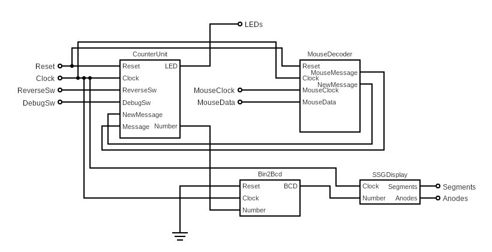

# Mouse Interfacing
> A18 - FPGA and mouse application

23 May 2022

## Problem Statement

Implement an application that allows the user to count the number of mouse clicks.
Functional requirements:
* Existing RESET button that will clear the SSD display (status "0000")
* The current status is displayed on the SSD
* Pressing the left mouse button will increase the current status
* Pressing the right mouse button will decrease the current status
* An IS_LEFT LED is lit, marking the fact that the left click increases and the right click decreases
* A REVERSE button/switch is used to reverse the mouse functions, IS_LEFT will turn off when pressed

The project will be carried out by **2 students.**

### Changes in Terminology

To ensure the internal consistency of the project, the following changes have been made to the terminology:
* increase -> increment, decrease -> decrement
* IS_LEFT -> leftmost LED (L1)
* REVERSE -> rightmost switch (V17)

Naming convention and capitalization throughout the project is PascalCase, except for types provided by built-in libraries. Single letter variables usually represent temporary or otherwise less significant bits of data.

## Overview

The general idea of the solution is to receive the message packets sent by the mouse, extract the significant bits from them, detect actual mouse clicks, and modify the internal state accordingly. This state should then be transformed into Binary Coded Decimal representation and shown on the Seven Segment Display.
The internal state management should be implemented in the form of a bidirectional counter, in accordance with the conditions governing the state transitions (for example, if the reverse switch is toggled, left clicks result in a decrement and right clicks result in an increment).

From a high-level perspective, the solution is divided into the following parts:
* **CounterUnit:** the main unit that manages the internal state
* **MouseDecoder:** the component responsible for decoding and forwarding the mouse packets
* **BinaryToBCD:** the component responsible for transforming the internal state into the BCD representation
* **SevenSegmentDisplay:** the component responsible for displaying a given number based on the BCD representation

There is also an additional utility library focused on structuring and validating mouse packets. The goal of this library is to provide an intuitive interface to work with, instead of having to manually count bits to determine their meaning.

### Hardware

The list of hardware used for this project is as follows:
* **FPGA:** Digilent Basys 3 (Xilinx Artix-7) board (XC7A35T-ICPG236C)
* **Mouse:** Logitech Pebble M350 Wireless Mouse
* Nokia CA-101 Micro USB data cable

With some changes to the constraints, it can be used with other boards as well. All the tested mouse models yielded similar results, the only requirement is for the mouse to have a scroll wheel and support the Microsoft Intellimouse protocol.

### Software

This project was built in the Xilinx Vivado IDE.

A Git repository with the full source code in VHDL and the resulting bitstream is available for the project, and it can be found [here](https://github.com/Raffy27/MouseDecoder).

### Communication

Communication with the mouse takes place through an integrated USB port, and a PS/2 decoder, which makes it easier to work with external devices. According to the documentation of this protocol, two inputs are generated: a clock input for notifying the receiving circuitry of the fact that there is new data present, and the actual data input that should be processed.

A valid transmission from the mouse is defined in the following table.
|  | Bit 7 | Bit 6 | Bit 5 | Bit 4 | Bit 3 | Bit 2 | Bit 1 | Bit 0 |
|---|-------|-------|-------|-------|-------|-------|-------|-------|
| Byte 1 | Y overflow | X overflow | Y sign bit | X sign bit | Always 1 | Middle Btn | Right Btn | Left Btn |
| Byte 2 | X Movement |
| Byte 3 | Y Movement |
| Byte 4 | Z Movement |

Additionally, transmissions are delimited by a *1* stop bit (used for signaling the end of the transmission, or an idle state), and a *0* start bit. Each byte also has a parity bit, which is used to detect transmission errors.

For example, a valid binary sequence would be:
| Index | Bit | Description |
|:-----:|:---:|-------------|
| 42    | 0   | Start bit   |
| 41    | 1   | Left mouse button currently pressed |
| 40    | 0   | Right mouse button currently not pressed |
| 39    | 0   | Middle mouse button currently not pressed |
| 38    | 1   | Always *1*  |
| 37    | 0   | X movement is a positive amount (^) |
| 36    | 1   | Y movement is a negative amount (^) |
| 35    | 0   | No overflow for X |
| 34    | 0   | No overflow for Y |
| 33    | 1   | Parity bit |
| 32    | 0   | Stop bit |
| 31    | 0   | Start bit |
| 30    | 0   | MSB of X movement |
| ...   | ... | Bits of X movement |
| 23    | ... | LSB of Y movement |
| 22    | 1   | Parity bit |
| 21    | 1   | Stop bit |
| 20    | 0   | Start bit |
| 19    | 0   | MSB of Y movement |
| ...   | ... | Bits of Y movement |
| 12    | ... | LSB of Y movement |
| 11    | 0   | Parity bit |
| 10    | 1   | Stop bit |
| 9     | 0   | Start bit |
| 8     | 0   | MSB of Z movement |
| ...   | ... | Bits of Z movement |
| 1     | ... | LSB of Z movement |
| 0     | 1   | Stop bit |

The data structure defined in the convenience library is used to represent the incoming mouse packets.

```vhdl
type Mouse_Message is record
    LeftClick:  STD_LOGIC;
    RightClick: STD_LOGIC;
    MiddleClick:STD_LOGIC;
    OverflowX:  STD_LOGIC;
    OverflowY:  STD_LOGIC;
    
    X: STD_LOGIC_VECTOR(8 downto 0);
    Y: STD_LOGIC_VECTOR(8 downto 0);
    Z: STD_LOGIC_VECTOR(8 downto 0);
end record;
```

## Detailed Implementation



This diagram is an overview of how the logic of the project is structured. Implementationally equivalent, although more detailed dot diagrams are available [here](https://gist.github.com/Raffy27/4ba46eaca7d5c0104027da35ae62520e).

The **CounterUnit** is the top-level component, responsible for managing the internal state (current number of clicks). Some of its inputs are passed further down the hierarchy to ensure a structural approach.

As the name suggests, the **MouseDecoder** unit has the role of receiving and decoding the mouse packets. Whenever the `MouseClock` signal becomes high, it increments an internal counter which keeps track of the number of bits received from the mouse. On the falling edge of the `MouseClock`, the new bit from `MouseData` is stored in a shift register. Whenever the number of received bits reaches `43` (thus the shift register is full), the current value of the shift register is passed to the **MouseTypes** library. If the packet is determined to be valid, a single clock pulse is generated on the `NewMessage` signal, and the state of this unit is reset.
This clock pulse is generated by a simple state machine with a trigger.
```vhdl
Pulse_Gen: process(Reset, Clock)
variable Idle: Boolean := true;
begin
    if Reset = '1' then
        Idle := true;
    elsif rising_edge(Clock) then
        NewMessage <= '0';
        if Idle then
            if Trigger = '1' then
                NewMessage <= '1';
                Idle := false;
            end if;
        else
            if Trigger = '0' then
                Idle := true;
            end if;
        end if;
    end if;
end process;
```

The **MouseTypes** library contains utility functions to check whether the received bits are indeed valid (parity and constant sanity checks) and to convert these into the representation specified above.

On the falling edge of the `NewMessage` signal, the **CounterUnit** checks the `LeftClick` and `RightClick` values of the new packet against the outputs of two D flip-flops to determine whether a click occurred, and if so, increments or decrements the internal state accordingly. It also considers the value of the `ReverseSw` input, which is tied to an LED to indicate whether the circuit is functioning in reverse mode.
```vhdl
if M.LeftClick = '0' and X = '1' then
    Temp := Temp + 1;
end if;
if M.RightClick = '0' and Y = '1' and Temp > 0 then
    Temp := Temp - 1;
end if;
```

The internal state is fed to the **SSGDisplay** unit, which calls upon a binary to BCD decoder (**Bin2Bcd**) component to obtain the BCD representation of its input. Using a multiplexing solution, it then generates and updates the necessary anode patterns while selecting the corresponding digit, in order to reach a refresh rate of ~10.48ms, one that the human eye perceives as a smooth change. For this, a counter of 20 bits is employed.

A `Reset` signal acts asynchronously on the whole project, setting the internal state to zero, and halting the decoding process. The LEDs will also flash for a brief moment.

This project also supports a Debug mode, which is activated by toggling the `DebugSw` input. In this mode, details about the arriving mouse packets (such as whether the buttons are pressed, the movement bytes are currently changing, an overflow occurred, etc.) are displayed on a row of LEDs. See below for details.

It can be noted that the project also supports simultaneous clicks: if both mouse buttons are pressed at the same time, both of them will take effect as soon as they are released, even though there was a time when they were "overlapping".

### Alternative Solutions

A less sophisticated, but more intuitive solution would be to use a simple modulo-43 counter to count the number of bits sent by the mouse and process the relevant bits according to this counter (every first bit is interpreted as a left click, and so on). This would reduce the cost and complexity of the solution because it would eliminate the need for intermediate registers, but it does not offer the versatility of the current solution, which in turn achieves true interfacing by parsing the packets.

## Debugging

In order to perform debugging and figure out what goes wrong for generic transmissions, packets were fragmented and displayed using the available LEDs. The binary sequence was then manually transferred and used as input for a Python script which decoded it into a human-readable format.

The script I wrote can be found [here](https://gist.github.com/Raffy27/8311754d9b667e47b5c9f626ba171ad6).

An example of its output is shown below.
```json
{
    "left": true,
    "middle": false,
    "right": false,
    "x_overflow": false,
    "y_overflow": false,
    "x": 5,
    "y": -4,
    "z": 1,
    "checks": true
}
```

Realtime debugging is also possible. To see some important information about incoming mouse packets, the debug switch must be toggled (R2). After toggling the switch, some of the LEDs will light up, according to the following pattern:
| LD15 | LD14 | LD13 | LD12 | LD11 | LD10 | LD9  | LD8  | LD7  | LD6  | LD5  | LD4  | LD3  | LD2  | LD1  | LD0  |
|:---:|:---:|:---:|:---:|:---:|:---:|:---:|:---:|:---:|:---:|:---:|:---:|:---:|:---:|:---:|:---:|
| Reverse | 0 | LeftClick | MiddleClick | RightClick | 0 | X Overflow | Y Overflow| X Change | Y Change | Z Change | 0 | Num(3) | Num(2) | Num(1) | Num(0) |

Num(n) represents the lower bits of the internal state. Using these bits of information, it is possible to debug potential processing and logic-related errors.

## Results


This is an animated showcase of the solution. The third LED from the left signifies a left click, and the fifth one a right click. The ones after that light up when the mouse moves, and the rightmost LEDs represent the last bits of the internal state.

## Acknowledgments
The PS/2 Mouse/Keyboard Protocol - Adam Chapweske, 1999
https://web.archive.org/web/20040928085222/http://panda.cs.ndsu.nodak.edu/~achapwes/PICmicro/PS2/ps2.htm

The PS/2 Mouse Interface (archive) - Adam Chapweske, 1999
https://web.archive.org/web/20041117095622/http://panda.cs.ndsu.nodak.edu:80/~achapwes/PICmicro/mouse/mouse.html

How to interface a mouse with Basys 3 FPGA - FPGA4Student
https://www.fpga4student.com/2017/12/how-to-interface-mouse-with-FPGA.html

PS/2 Port - Wikipedia
https://en.wikipedia.org/wiki/PS/2_port

Circuit Diagram Editor
https://www.circuit-diagram.org/editor/